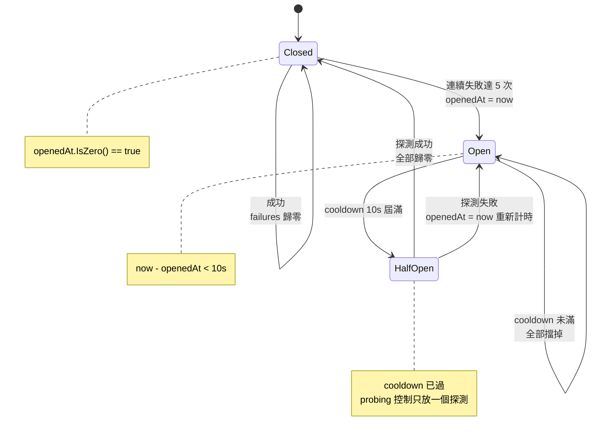
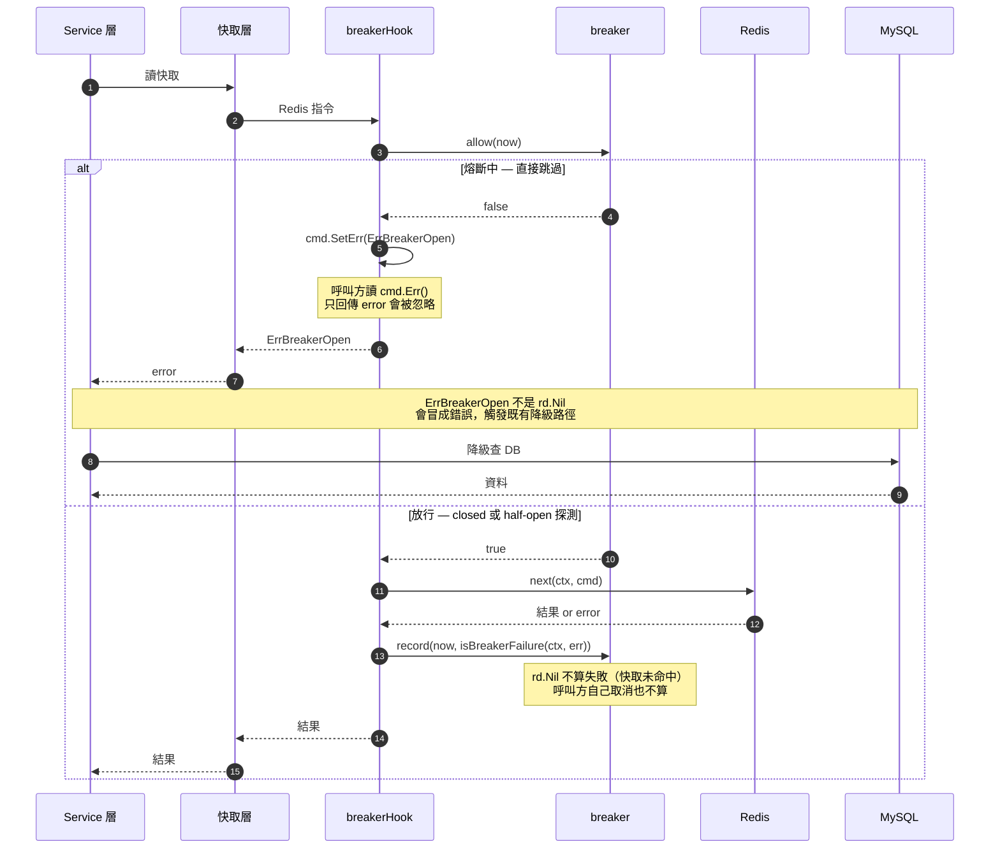
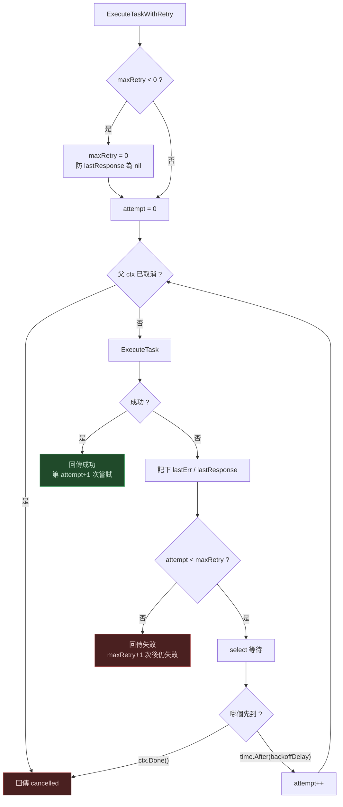
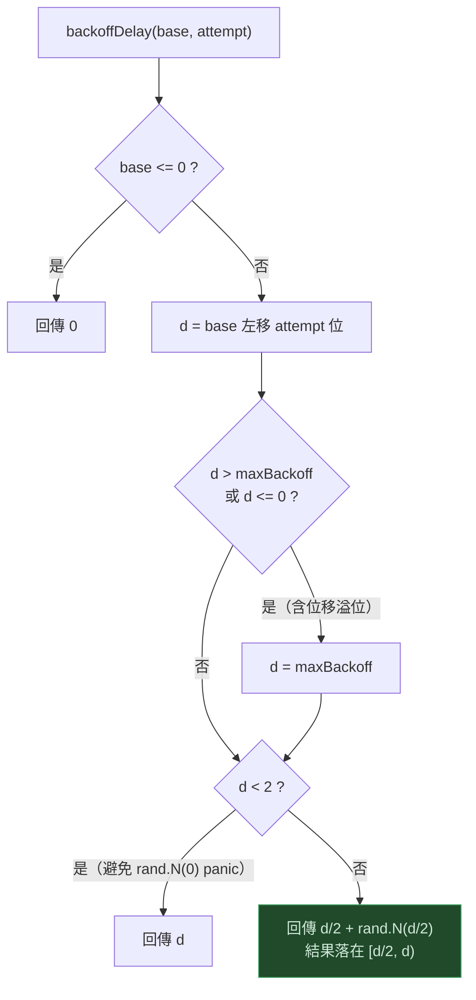

# Resilience Patterns — 流程圖

對應實作：

| 模式 | 位置 |
|---|---|
| Circuit Breaker | `internal/redis/breaker.go` |
| Retry with Backoff + Jitter | `internal/service/task_executor_service.go` |

進度與 Bulkhead 的延後理由見 [`TODO.md`](../TODO.md) 的 Resilience Patterns 段落。

---

## 1. 熔斷器狀態機

三個狀態沒有用 enum，靠 `openedAt` 與 `probing` 兩個欄位隱含表達。

常數定義於 `breaker.go`：`breakerThreshold = 5`、`breakerCooldown = 10 * time.Second`。

---

## 2. 請求路徑

`breakerHook` 實作 go-redis 的 `Hook` 介面攔截 `ProcessHook`，因此快取層與 service 層不需改動，降級行為自動成立。

存在的理由不是保護 Redis，而是保護延遲：Redis 掛掉時 `ReadTimeout` 是 3 秒，每個請求都要先付這 3 秒才會降級去查 DB。熔斷後直接跳過，延遲回到正常。

---

## 3. 重試主迴圈

`ExecuteTaskWithRetry`

等待用 `select` 同時監聽 `ctx.Done()`，而不是 `time.Sleep` —— 否則重試等待中的取消請求會被無視，白等完整段 backoff。

---

## 4. backoffDelay — 指數退避 + equal jitter

純指數退避會讓多個 client 同時失敗後一起重試，下游剛要復原就被同步打回去（thundering herd）。一半固定一半隨機，把重試攤在時間窗內，尖峰負載大致砍半。

---

## 5. 兩者的分工

| | 處理的故障 | 時間尺度 | 行為 |
|---|---|---|---|
| Retry + backoff + jitter | 網路抖動、GC 暫停、瞬間過載 | 秒 | 撐過去 |
| Circuit Breaker | 服務掛了、部署炸了 | 分鐘 | fail fast + 降級 |

兩者必須成對。**單獨用 retry 是危險的** —— 重試會放大負載，下游掛掉時一個失敗請求變成四個失敗請求。熔斷器就是那個放大的上限。

---

## 邊界守衛

實作中四個非顯而易見的守衛，移除任一個都會出問題：

| 守衛 | 位置 | 移除後的後果 |
|---|---|---|
| 等待期用 `select` 監聽 `ctx.Done()` | `task_executor_service.go` | 取消請求被無視，白等完整段 backoff |
| 位移溢位守衛 `d <= 0` | `backoffDelay` | attempt 大時 `base << attempt` 溢位成負數，出現負延遲 |
| 熔斷時 `failures = 0` 歸零 | `breaker.record` | failures 永遠 >= threshold，`b.probing` 分支變死碼，half-open 探測失敗處理不到 |
| `maxRetry < 0` 修正為 0 | `ExecuteTaskWithRetry` | 迴圈不執行，`lastResponse` 為 nil，回傳時 nil pointer dereference |

## 已知限制

熔斷判斷用「連續失敗次數」而非滑動視窗錯誤率（見 `breaker.go` 的 `ponytail:` 註解）。低流量下夠用，但混合流量（大量成功穿插少量失敗）永遠不會熔斷。要處理那個情境得換成時間視窗內的失敗比例。
