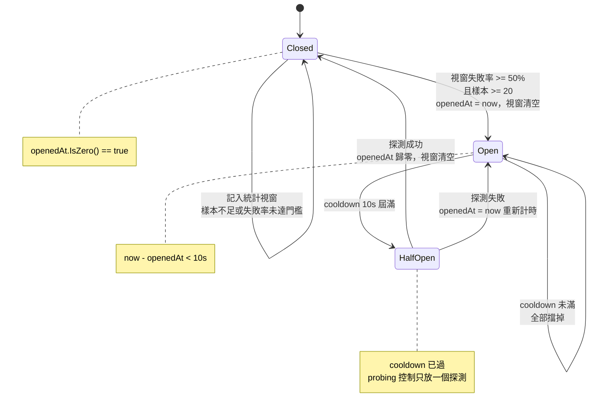
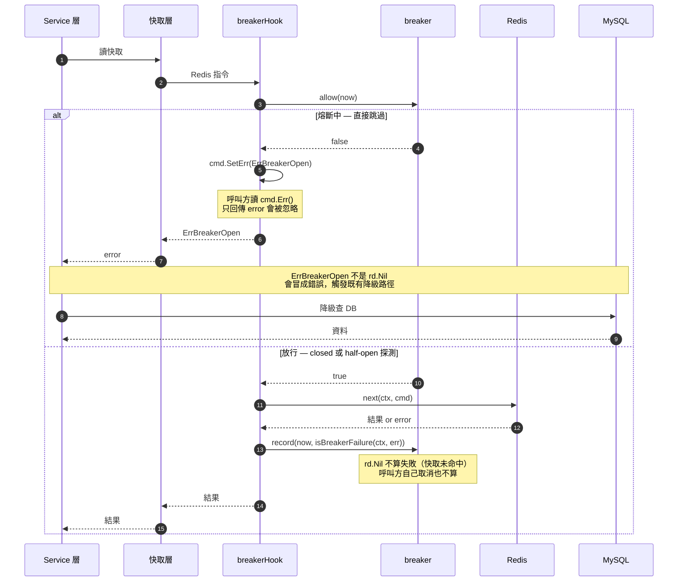
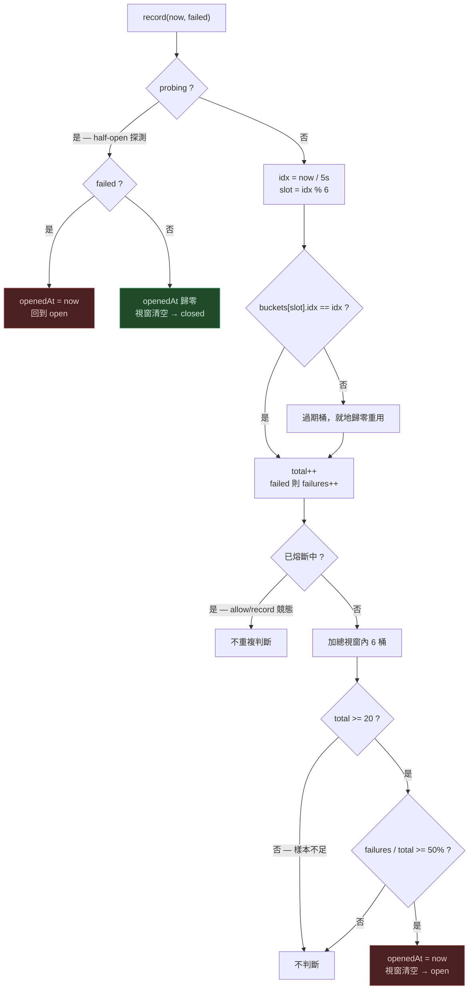
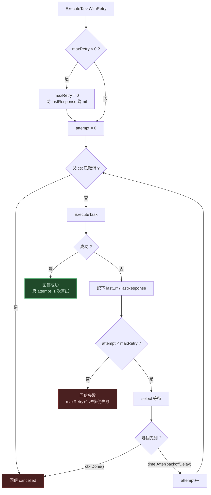
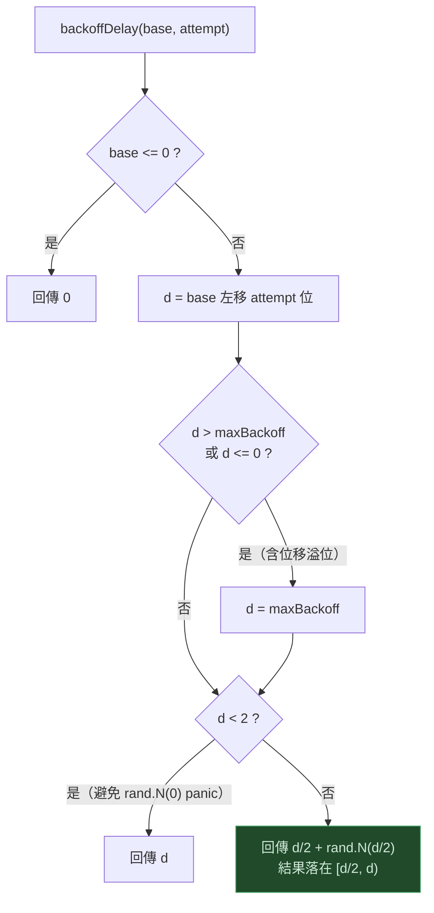

# Resilience Patterns — 流程圖

對應實作：

| 模式 | 位置 |
|---|---|
| Circuit Breaker（滑動視窗失敗率） | `internal/redis/breaker.go` |
| Retry with Backoff + Jitter | `internal/service/task_executor_service.go` |

不熟悉這兩個模式的目的與原理，先看 [`RESILIENCE_PATTERNS_101.md`](RESILIENCE_PATTERNS_101.md)（從問題出發的教學版）。

進度與 Bulkhead 的延後理由見 [`TODO.md`](../TODO.md) 的 Resilience Patterns 段落。

## 與教學版的對應

| 本文段落 | 教學版 `RESILIENCE_PATTERNS_101.md` 對應段落 |
|---|---|
| 1. 熔斷器狀態機 | 四、熔斷器：學會放棄 — 為什麼需要三個狀態 |
| 2. 請求路徑 | 六、走一遍程式碼 — 怎麼接進去、`isBreakerFailure`；八、為什麼裝在 Redis 而不是 MySQL |
| 3. record — 統計與熔斷判斷 | 五、怎麼判定「它掛了」（整段）；六、走一遍程式碼 — `record` 三段 |
| 4. 重試主迴圈 | 二、第一直覺：重試；七之 5 — `select` 而不是 `time.Sleep` |
| 5. backoffDelay | 二 — 坑一（退避）、坑二（jitter）；七之 6 — 位移溢位 |
| 6. 兩者的分工 | 三、但重試解不了那場事故；十、一頁總結 |
| 邊界守衛 | 七、那些守衛在防什麼 |
| 已知限制 | 九、目前的限制 |

---

## 1. 熔斷器狀態機

> 為什麼要三個狀態、half-open 存在的理由：教學版〈四、熔斷器：學會放棄〉

狀態由 `openedAt` 與 `probing` 推導，集中在 `currentState(now)` 一處。**刻意不存成欄位** —— `open → half-open` 是時間走到了自然發生的轉換，沒有任何程式碼在執行；存起來就需要背景 timer，或變成第二個真相來源而有機會與 `openedAt` 不一致。

常數定義於 `breaker.go`：

| 常數 | 值 | 作用 |
|---|---|---|
| `breakerWindow` | 30s | 統計視窗長度 |
| `breakerBuckets` | 6 | 視窗分桶數，每桶 5 秒 |
| `breakerFailureRate` | 0.5 | 失敗率門檻 |
| `breakerMinRequests` | 20 | 樣本數不足不判斷 |
| `breakerCooldown` | 10s | 熔斷後多久放行探測 |

---

## 2. 請求路徑

> Hook 為什麼讓上層不用改、什麼不算失敗：教學版〈六、走一遍程式碼〉
> 為什麼裝在 Redis 而不是 MySQL：教學版〈八〉

`breakerHook` 實作 go-redis 的 `Hook` 介面攔截 `ProcessHook`，因此快取層與 service 層不需改動，降級行為自動成立。

存在的理由不是保護 Redis，而是保護延遲：Redis 掛掉時 `ReadTimeout` 是 3 秒，每個請求都要先付這 3 秒才會降級去查 DB。熔斷後直接跳過，延遲回到正常。

---

## 3. record — 統計與熔斷判斷

> 為什麼從連續計數換成視窗失敗率、minRequests 與環形分桶的原理：教學版〈五、怎麼判定「它掛了」〉

環形緩衝的桶以絕對桶號（`idx`）標記，過期就地歸零，因此不需要背景 goroutine 清理。

探測結果走獨立分支，**不進統計視窗** —— 單一樣本不該被稀釋在失敗率裡。

---

## 4. 重試主迴圈

> 為什麼要重試、為什麼等待要用 `select`：教學版〈二〉與〈七之 5〉

`ExecuteTaskWithRetry`

等待用 `select` 同時監聽 `ctx.Done()`，而不是 `time.Sleep` —— 否則重試等待中的取消請求會被無視，白等完整段 backoff。

---

## 5. backoffDelay — 指數退避 + equal jitter

> 退避與 jitter 分別在解什麼問題（thundering herd）：教學版〈二 — 坑一、坑二〉

純指數退避會讓多個 client 同時失敗後一起重試，下游剛要復原就被同步打回去（thundering herd）。一半固定一半隨機，把重試攤在時間窗內，尖峰負載大致砍半。

---

## 6. 兩者的分工

> 為什麼重試單獨用是危險的：教學版〈三〉

| | 處理的故障 | 時間尺度 | 行為 |
|---|---|---|---|
| Retry + backoff + jitter | 網路抖動、GC 暫停、瞬間過載 | 秒 | 撐過去 |
| Circuit Breaker | 服務掛了、部署炸了 | 分鐘 | fail fast + 降級 |

兩者必須成對。**單獨用 retry 是危險的** —— 重試會放大負載，下游掛掉時一個失敗請求變成四個失敗請求。熔斷器就是那個放大的上限。

---

## 邊界守衛

> 每個守衛的完整說明與程式碼：教學版〈七、那些守衛在防什麼〉

實作中七個非顯而易見的守衛，移除任一個都會出問題：

| 守衛 | 位置 | 移除後的後果 |
|---|---|---|
| `breakerMinRequests` 樣本門檻 | `breaker.record` | 視窗內第一個失敗就是 100% 失敗率，立刻誤觸熔斷 |
| 熔斷與探測成功時 `resetWindow` | `breaker.record` | 恢復後舊失敗仍在視窗內，一兩次失敗又把失敗率推過門檻 |
| 過期桶就地歸零 | `breaker.currentBucket` | 環形緩衝繞一圈後，舊統計被算進新視窗 |
| 探測結果不進統計視窗 | `breaker.record` | 單一樣本被失敗率稀釋，探測失敗無法立即反應 |
| 等待期用 `select` 監聽 `ctx.Done()` | `task_executor_service.go` | 取消請求被無視，白等完整段 backoff |
| 位移溢位守衛 `d <= 0` | `backoffDelay` | attempt 大時 `base << attempt` 溢位成負數，退避失效變成瘋狂重試 |
| `maxRetry < 0` 修正為 0 | `ExecuteTaskWithRetry` | 迴圈不執行，`lastResponse` 為 nil，回傳時 nil pointer dereference |

## 已知限制

> 這兩個限制的來由：教學版〈九、目前的限制〉

環形緩衝以桶為單位（每桶 5 秒），所以視窗邊界是**階梯式**而非平滑滑動 —— 最舊的桶會整桶掉出，誤差最多一個桶。要更精確得記錄每筆呼叫的時間戳，記憶體隨流量成長，不值得。

`breakerMinRequests = 20` 是主要的校準旋鈕：20 筆 / 30 秒約等於 0.67 QPS 才有判斷力。流量更低的環境要往下調，否則熔斷器實質上永遠不會作用。
